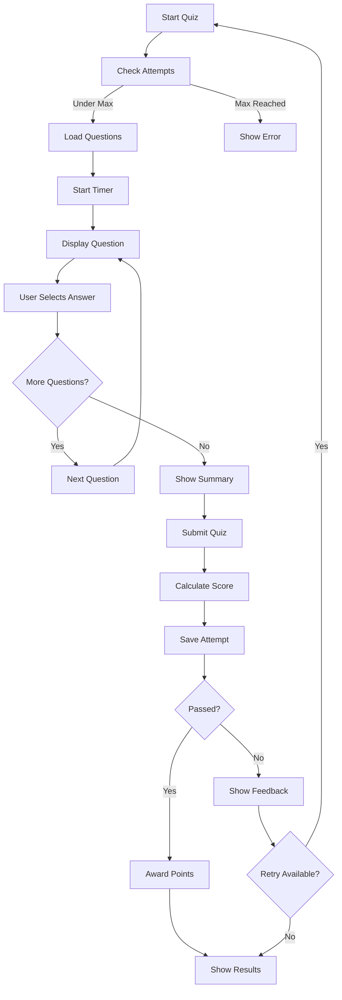

# Assessment & Quiz - ULP ASN

Dokumen ini menjelaskan sistem penilaian dan quiz dalam aplikasi TITAN ULP.

---

## 📚 Gambaran Umum

Sistem assessment mendukung berbagai jenis quiz untuk mengukur pemahaman peserta:

- **Pre-test** - Sebelum memulai kursus
- **Post-test** - Setelah menyelesaikan kursus
- **Knowledge Check** - Quiz singkat per lesson
- **Module Quiz** - Quiz di akhir setiap module

---

## 📝 Tipe Pertanyaan

### 1. Multiple Choice

Pilihan ganda dengan satu jawaban benar.

```typescript
{
  type: "MULTIPLE_CHOICE",
  content: "Apa kepanjangan dari ASN?",
  options: [
    { text: "Aparatur Sipil Negara", isCorrect: true },
    { text: "Aparatur Sistem Nasional", isCorrect: false },
    { text: "Aparat Sipil Negeri", isCorrect: false },
    { text: "Aparatur Sipil Nasional", isCorrect: false }
  ],
  points: 1,
  explanation: "ASN adalah singkatan dari Aparatur Sipil Negara."
}
```

### 2. True/False

Pertanyaan benar atau salah.

```typescript
{
  type: "TRUE_FALSE",
  content: "PNS adalah bagian dari ASN.",
  options: [
    { text: "Benar", isCorrect: true },
    { text: "Salah", isCorrect: false }
  ],
  points: 1
}
```

### 3. Essay

Jawaban panjang dengan penilaian manual atau AI.

```typescript
{
  type: "ESSAY",
  content: "Jelaskan peran ASN dalam reformasi birokrasi!",
  points: 10,
  modelAnswer: "Model answer for reference...",
  rubric: {
    excellent: { minPoints: 9, criteria: "Lengkap dan mendalam" },
    good: { minPoints: 7, criteria: "Lengkap" },
    fair: { minPoints: 5, criteria: "Cukup" },
    poor: { minPoints: 0, criteria: "Kurang" }
  }
}
```

### 4. Short Answer

Jawaban singkat dengan keyword matching.

```typescript
{
  type: "SHORT_ANSWER",
  content: "Sebutkan 3 nilai dasar ASN!",
  points: 3,
  keywords: ["akuntabilitas", "nasionalisme", "etika publik"]
}
```

---

## 🎯 Quiz Types

### Pre-Test

| Property | Value |
|----------|-------|
| Timing | Sebelum mulai kursus |
| Required | Opsional |
| Affects Grade | Tidak |
| Purpose | Mengukur pengetahuan awal |

### Post-Test

| Property | Value |
|----------|-------|
| Timing | Setelah semua lessons selesai |
| Required | Ya |
| Affects Grade | Ya |
| Passing Score | 70% (configurable) |

### Knowledge Check

| Property | Value |
|----------|-------|
| Timing | Setelah setiap lesson |
| Required | Tidak |
| Affects Grade | Tidak |
| Purpose | Reinforcement learning |

### Module Quiz

| Property | Value |
|----------|-------|
| Timing | Di akhir module |
| Required | Ya |
| Affects Grade | Ya |
| Passing Score | 70% (configurable) |

---

## 📊 Quiz Configuration

### Create Quiz

```typescript
const quiz = await createQuiz({
  moduleId: "module-id",
  title: "Quiz Module 1",
  description: "Uji pemahaman materi module 1",
  type: "POST_TEST",
  passingScore: 70,
  timeLimit: 30,         // minutes
  maxAttempts: 3,
  shuffleQuestions: true,
  showCorrectAnswers: true,
  questions: [
    {
      type: "MULTIPLE_CHOICE",
      content: "Question 1...",
      options: [...],
      points: 1
    },
    // more questions
  ]
})
```

### Settings

| Setting | Description | Default |
|---------|-------------|---------|
| `passingScore` | Nilai minimum untuk lulus | 70% |
| `timeLimit` | Batas waktu (menit) | null (unlimited) |
| `maxAttempts` | Maksimal percobaan | null (unlimited) |
| `shuffleQuestions` | Acak urutan soal | false |
| `shuffleOptions` | Acak urutan pilihan | false |
| `showCorrectAnswers` | Tampilkan jawaban setelah submit | true |
| `allowReview` | Izinkan review jawaban | true |

---

## 🎮 Quiz Flow



---

## 📝 Taking a Quiz

### Quiz Interface

```
┌─────────────────────────────────────────────────────────┐
│  Quiz Title                                ⏱ 25:30      │
├─────────────────────────────────────────────────────────┤
│                                                         │
│  Question 1 of 10                              [2 pts]  │
│                                                         │
│  Apa kepanjangan dari ASN?                              │
│                                                         │
│  ○ Aparatur Sipil Negara                                │
│  ○ Aparatur Sistem Nasional                             │
│  ○ Aparat Sipil Negeri                                  │
│  ○ Aparatur Sipil Nasional                              │
│                                                         │
├─────────────────────────────────────────────────────────┤
│  [← Previous]                              [Next →]     │
│                                                         │
│  Progress: ●●●●●○○○○○ (5/10)                            │
└─────────────────────────────────────────────────────────┘
```

### Submit Quiz

```typescript
const result = await submitQuizAttempt({
  quizId: "quiz-id",
  answers: [
    { questionId: "q1", selectedOptions: [0] },
    { questionId: "q2", selectedOptions: [2] },
    { questionId: "q3", answerText: "Essay answer..." }
  ]
})

// Returns:
{
  success: true,
  attempt: {
    id: "attempt-id",
    score: 85,
    isPassed: true,
    submittedAt: "2026-01-27T12:00:00Z"
  }
}
```

---

## 📊 Grading

### Auto-Grading (Multiple Choice & True/False)

```typescript
function gradeMultipleChoice(answer: Answer, question: Question): GradeResult {
  const selectedIndex = answer.selectedOptions[0]
  const correctIndex = question.options.findIndex(o => o.isCorrect)
  
  const isCorrect = selectedIndex === correctIndex
  
  return {
    isCorrect,
    pointsEarned: isCorrect ? question.points : 0
  }
}
```

### AI Grading (Essay)

```typescript
async function gradeEssay(answer: string, question: Question): Promise<GradeResult> {
  const prompt = `
    Model Answer: ${question.modelAnswer}
    Rubric: ${JSON.stringify(question.rubric)}
    Student Answer: ${answer}
    
    Evaluate the student answer and provide:
    1. Score (0-${question.points})
    2. Feedback explaining the grade
  `
  
  const response = await ai.generate(prompt)
  
  return {
    pointsEarned: response.score,
    aiFeedback: response.feedback
  }
}
```

### Score Calculation

```typescript
const totalPoints = questions.reduce((sum, q) => sum + q.points, 0)
const earnedPoints = answers.reduce((sum, a) => sum + a.pointsEarned, 0)
const score = (earnedPoints / totalPoints) * 100
const isPassed = score >= quiz.passingScore
```

---

## 📈 Results & Feedback

### Result View

```
┌─────────────────────────────────────────────────────────┐
│                    Quiz Results                          │
├─────────────────────────────────────────────────────────┤
│                                                         │
│                       ✓ LULUS                           │
│                                                         │
│                    Score: 85%                           │
│                                                         │
│  ────────────────────────────────────────────────────   │
│                                                         │
│  Benar    : 8/10                                        │
│  Salah    : 2/10                                        │
│  Waktu    : 18:45                                       │
│  Poin     : +30                                         │
│                                                         │
├─────────────────────────────────────────────────────────┤
│  [ Review Jawaban ]          [ Lanjut ke Lesson ]       │
└─────────────────────────────────────────────────────────┘
```

### Answer Review

```
┌─────────────────────────────────────────────────────────┐
│  Question 2                                  ✗ Salah    │
├─────────────────────────────────────────────────────────┤
│                                                         │
│  Berapa jumlah nilai inti ASN?                          │
│                                                         │
│  ○ 3 nilai     ← Your answer                            │
│  ● 5 nilai     ← Correct answer                         │
│  ○ 7 nilai                                              │
│  ○ 9 nilai                                              │
│                                                         │
│  📖 Penjelasan:                                         │
│  Ada 5 nilai inti ASN yaitu: Akuntabilitas,             │
│  Nasionalisme, Etika Publik, Komitmen Mutu,             │
│  dan Anti Korupsi (ANEKA).                              │
│                                                         │
└─────────────────────────────────────────────────────────┘
```

---

## 🏆 Points & Gamification

### Points Awarded

| Outcome | Points |
|---------|--------|
| Quiz Passed | +30 |
| First Try Pass | Bonus +10 |
| Perfect Score | Bonus +20 |
| Course Complete | +100 |

### Badges

| Badge | Criteria |
|-------|----------|
| 🎯 **Quiz Master** | Pass 10 quizzes |
| ⭐ **Perfect Score** | Get 100% on any quiz |
| 🚀 **Fast Learner** | Pass quiz on first try (5x) |
| 📚 **Completionist** | Complete all quizzes in course |

---

## 📊 Analytics

### Quiz Statistics

```typescript
const stats = await getQuizStats(quizId)

// Returns:
{
  totalAttempts: 150,
  uniqueUsers: 85,
  averageScore: 76.5,
  passRate: 82.3,
  averageTime: "18:30",
  questionAnalysis: [
    {
      questionId: "q1",
      correctRate: 92.5,
      averageTime: 45
    },
    // ...
  ]
}
```

### Question Analysis

Untuk setiap pertanyaan:
- Success rate (% yang menjawab benar)
- Average time spent
- Common wrong answers
- Discrimination index

---

## 🔧 Administration

### Create Quiz (Instructor)

1. Navigasi ke **Course Editor** → **Module** → **Add Quiz**
2. Set quiz properties:
   - Title & description
   - Type (pre-test/post-test/module quiz)
   - Passing score & time limit
3. Add questions:
   - Select question type
   - Enter question text
   - Add options (for MC/TF)
   - Set correct answer
   - Add explanation
4. Preview & publish

### Edit Quiz

```typescript
await updateQuiz(quizId, {
  title: "Updated Title",
  passingScore: 80,
  timeLimit: 45
})
```

### Question Bank

```typescript
// Import from question bank
await importQuestionsFromBank(quizId, {
  bankId: "bank-id",
  questionIds: ["q1", "q2", "q3"]
})

// Random selection
await importRandomQuestions(quizId, {
  bankId: "bank-id",
  count: 10,
  tags: ["asn", "reformasi"]
})
```

---

## 📱 API Reference

### Server Actions

| Function | Description |
|----------|-------------|
| `createQuiz(data)` | Create new quiz |
| `updateQuiz(id, data)` | Update quiz |
| `deleteQuiz(id)` | Delete quiz |
| `getQuizById(id)` | Get quiz by ID |
| `submitQuizAttempt(data)` | Submit quiz answers |
| `getAttemptResult(id)` | Get attempt results |
| `getQuizStats(id)` | Get quiz analytics |

### Data Types

```typescript
interface Quiz {
  id: string
  moduleId: string
  title: string
  description?: string
  type: "PRE_TEST" | "POST_TEST" | "KNOWLEDGE_CHECK"
  passingScore: number
  timeLimit?: number
  maxAttempts?: number
  shuffleQuestions: boolean
  showCorrectAnswers: boolean
  questions: Question[]
}

interface Question {
  id: string
  type: "MULTIPLE_CHOICE" | "TRUE_FALSE" | "ESSAY" | "SHORT_ANSWER"
  content: string
  options?: Option[]
  points: number
  explanation?: string
  rubric?: Rubric
  modelAnswer?: string
}

interface QuizAttempt {
  id: string
  userId: string
  quizId: string
  startedAt: Date
  submittedAt?: Date
  score?: number
  isPassed?: boolean
  answers: QuestionAnswer[]
}
```

---

## 🔒 Security

### Anti-Cheating Measures

1. **Question Randomization** - Acak urutan soal & pilihan
2. **Time Limits** - Batas waktu ketat
3. **Tab Detection** - Deteksi pergantian tab
4. **Copy Prevention** - Disable copy-paste pada soal
5. **IP Logging** - Catat IP address

### Attempt Validation

```typescript
// Server-side validation
function validateAttempt(attempt: QuizAttempt) {
  // Check time limit
  if (quiz.timeLimit) {
    const duration = attempt.submittedAt - attempt.startedAt
    if (duration > quiz.timeLimit * 60 * 1000) {
      throw new Error("Time limit exceeded")
    }
  }
  
  // Check max attempts
  const existingAttempts = await getAttemptCount(userId, quizId)
  if (quiz.maxAttempts && existingAttempts >= quiz.maxAttempts) {
    throw new Error("Max attempts reached")
  }
}
```

---

*Dokumen ini terakhir diperbarui: 27 Januari 2026*
