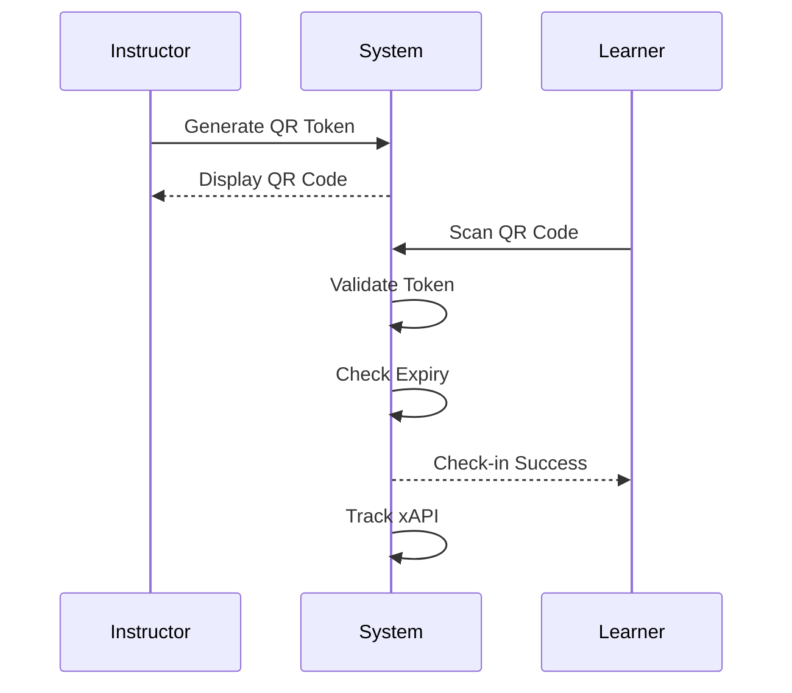
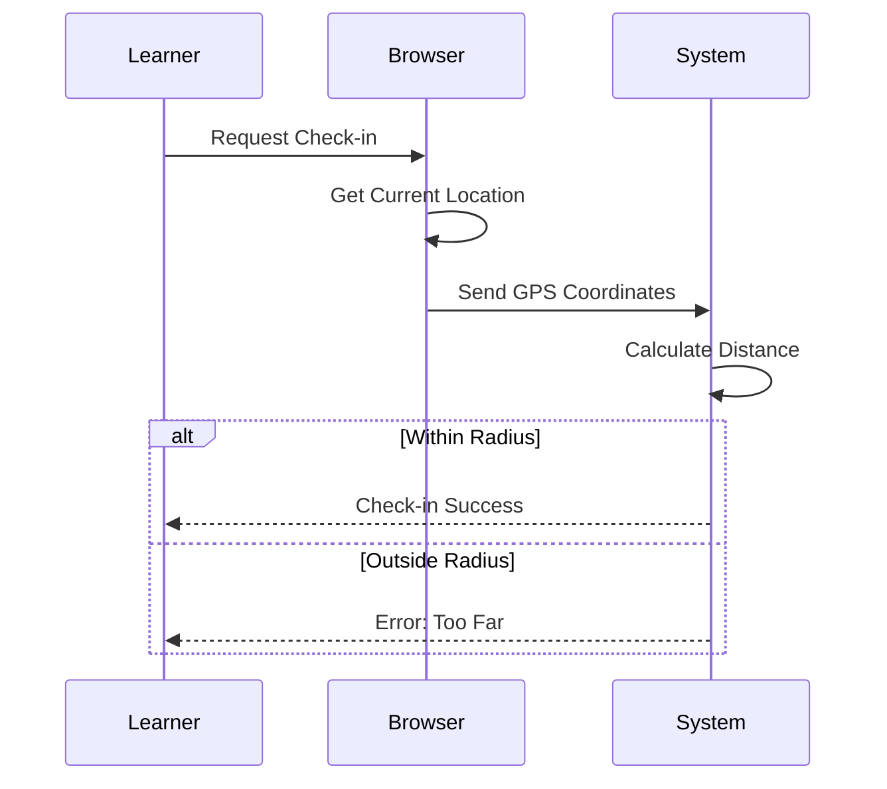

# Attendance System - ULP ASN

Dokumen ini menjelaskan sistem kehadiran dalam aplikasi TITAN ULP.

---

## 📚 Gambaran Umum

Sistem kehadiran mendukung berbagai metode check-in untuk sesi tatap muka (classroom) dan sesi live online:

- **QR Code** - Scan QR code dari instructor
- **GPS** - Verifikasi lokasi dengan GPS
- **Manual** - Input manual oleh instructor
- **Zoom Auto** - Tracking otomatis dari Zoom

---

## 🎯 Check-in Methods

### 1. QR Code Check-in

Peserta scan QR code yang ditampilkan instructor.



#### Generate QR Token

```typescript
// Generate token for session
const token = await generateSessionQR(sessionId)

// Token expires in 5 minutes
{
  id: "token-id",
  sessionId: "session-id",
  token: "abc123...",
  expiresAt: "2026-01-27T10:05:00Z"
}
```

#### Scan QR

```typescript
// Learner scans QR
const result = await checkInWithQR(sessionId, token)

if (result.success) {
  // Check-in recorded
  showSuccess("Check-in berhasil!")
}
```

### 2. GPS Check-in

Verifikasi kehadiran berdasarkan lokasi GPS.



#### Setup Session Location

```typescript
const session = await createSession({
  courseId: "course-id",
  title: "Sesi Tatap Muka 1",
  type: "CLASSROOM",
  startTime: new Date("2026-01-27T09:00:00"),
  endTime: new Date("2026-01-27T12:00:00"),
  
  // Location settings
  location: "Ruang Pelatihan Lt. 3",
  latitude: -6.175392,
  longitude: 106.827153,
  radius: 100  // meters
})
```

#### GPS Check-in

```typescript
// Get current position
navigator.geolocation.getCurrentPosition(async (position) => {
  const result = await checkInWithGPS(
    sessionId,
    position.coords.latitude,
    position.coords.longitude
  )
  
  if (result.success) {
    showSuccess(`Check-in berhasil! (${result.distance}m dari lokasi)`)
  } else {
    showError(result.error)
  }
})
```

### 3. Manual Check-in

Instructor melakukan check-in manual untuk peserta.

```typescript
// Single learner
await checkInManual(sessionId, learnerId)

// Bulk check-in
await bulkCheckIn(sessionId, {
  learnerIds: ["user-1", "user-2", "user-3"],
  status: "PRESENT"
})
```

### 4. Zoom Auto-Tracking

Untuk sesi live online via Zoom, kehadiran di-track otomatis.

```typescript
// Zoom webhook handler
export async function handleZoomWebhook(event: ZoomEvent) {
  if (event.type === "meeting.participant_joined") {
    await recordZoomAttendance(
      event.payload.meeting_id,
      event.payload.participant.email,
      "JOIN"
    )
  }
  
  if (event.type === "meeting.participant_left") {
    await recordZoomAttendance(
      event.payload.meeting_id,
      event.payload.participant.email,
      "LEAVE"
    )
  }
}
```

---

## 📊 Attendance Status

| Status | Description | Icon |
|--------|-------------|------|
| `PRESENT` | Hadir tepat waktu | ✅ |
| `LATE` | Hadir terlambat | ⚠️ |
| `ABSENT` | Tidak hadir | ❌ |
| `EXCUSED` | Izin (dengan keterangan) | 📝 |

### Status Rules

```typescript
function determineStatus(checkInTime: Date, sessionStart: Date): AttendanceStatus {
  const diffMinutes = (checkInTime - sessionStart) / 60000
  
  if (diffMinutes <= 15) {
    return "PRESENT"
  } else if (diffMinutes <= 30) {
    return "LATE"
  } else {
    return "ABSENT"  // Terlambat > 30 menit
  }
}
```

---

## 📱 Instructor Interface

### Attendance Dashboard

```
┌─────────────────────────────────────────────────────────────────┐
│  Session: Pelatihan Kepemimpinan - Sesi 1                       │
│  📅 27 Jan 2026, 09:00 - 12:00                                  │
│  📍 Ruang Pelatihan Lt. 3                                       │
├─────────────────────────────────────────────────────────────────┤
│                                                                 │
│  [📱 Tampilkan QR Code]  [📍 Aktifkan GPS]  [➕ Manual Check-in] │
│                                                                 │
├─────────────────────────────────────────────────────────────────┤
│  Summary: 25 Hadir | 3 Terlambat | 2 Tidak Hadir | 0 Izin       │
├────────────┬────────────┬────────────┬────────┬─────────────────┤
│ Nama       │ NIP        │ Waktu      │ Status │ Metode          │
├────────────┼────────────┼────────────┼────────┼─────────────────┤
│ Siti A.    │ 19920101   │ 08:55      │ ✅     │ QR              │
│ Budi S.    │ 19850515   │ 09:20      │ ⚠️     │ GPS             │
│ Ahmad R.   │ 19901020   │ -          │ ❌     │ -               │
│ Dewi F.    │ 19880303   │ 08:50      │ ✅     │ Manual          │
└────────────┴────────────┴────────────┴────────┴─────────────────┘
```

### QR Code Display

```tsx
const QRDisplay = ({ session }) => {
  const [qrData, setQrData] = useState(null)
  const [timeLeft, setTimeLeft] = useState(300) // 5 minutes
  
  useEffect(() => {
    generateNewQR()
    const interval = setInterval(() => {
      setTimeLeft(prev => {
        if (prev <= 0) {
          generateNewQR()
          return 300
        }
        return prev - 1
      })
    }, 1000)
    return () => clearInterval(interval)
  }, [])
  
  return (
    <div className="qr-display">
      <h2>Scan untuk Check-in</h2>
      <QRCode value={qrData?.token} size={300} />
      <p>Berlaku: {formatTime(timeLeft)}</p>
      <Button onClick={generateNewQR}>Refresh QR</Button>
    </div>
  )
}
```

---

## 📱 Learner Interface

### Check-in Screen

```
┌─────────────────────────────────────┐
│        Pelatihan Kepemimpinan       │
│        Sesi 1 - Tatap Muka          │
├─────────────────────────────────────┤
│                                     │
│         ┌─────────────────┐         │
│         │                 │         │
│         │   📷 Scan QR    │         │
│         │                 │         │
│         └─────────────────┘         │
│                                     │
│              - ATAU -               │
│                                     │
│     [📍 Check-in dengan GPS]        │
│                                     │
├─────────────────────────────────────┤
│  ⏰ Sesi: 09:00 - 12:00             │
│  📍 Ruang Pelatihan Lt. 3           │
└─────────────────────────────────────┘
```

### Success Screen

```
┌─────────────────────────────────────┐
│                                     │
│              ✅                     │
│                                     │
│      Check-in Berhasil!             │
│                                     │
│      Waktu: 08:55:30                │
│      Status: HADIR                  │
│      Poin: +20                      │
│                                     │
│    [Lihat Detail Sesi]              │
│                                     │
└─────────────────────────────────────┘
```

---

## 🔧 Technical Implementation

### Database Schema

```prisma
model CourseSession {
  id              String            @id
  courseId        String
  title           String
  type            SessionType
  startTime       DateTime
  endTime         DateTime
  
  // Location (classroom)
  location        String?
  latitude        Float?
  longitude       Float?
  radius          Int?
  
  // Online (zoom/live)
  zoomMeetingId   String?
  zoomJoinUrl     String?
  streamUrl       String?
  
  attendance      Attendance[]
  tokens          AttendanceToken[]
}

model Attendance {
  id            String           @id
  sessionId     String
  userId        String
  status        AttendanceStatus
  checkInTime   DateTime
  checkInMethod CheckInMethod
  latitude      Float?
  longitude     Float?
  notes         String?
}

model AttendanceToken {
  id        String   @id
  sessionId String
  token     String   @unique
  expiresAt DateTime
  createdAt DateTime
}
```

### Server Actions

```typescript
// attendance.ts

// QR Check-in
export async function checkInWithQR(sessionId: string, token: string) {
  // 1. Validate token
  const tokenRecord = await validateToken(sessionId, token)
  if (!tokenRecord) {
    return { error: "Token tidak valid atau kadaluarsa" }
  }
  
  // 2. Check session timing
  const session = await getSession(sessionId)
  if (!isSessionActive(session)) {
    return { error: "Sesi belum dimulai atau sudah berakhir" }
  }
  
  // 3. Check existing attendance
  const existing = await getExistingAttendance(sessionId, userId)
  if (existing) {
    return { error: "Anda sudah check-in untuk sesi ini" }
  }
  
  // 4. Create attendance record
  const status = determineStatus(new Date(), session.startTime)
  const attendance = await createAttendance({
    sessionId,
    userId,
    status,
    checkInMethod: "QR_CODE"
  })
  
  // 5. Award points
  await awardPoints(userId, "ATTENDANCE_PRESENT")
  
  // 6. Track xAPI
  await trackAttendance(userId, sessionId, status)
  
  return { success: true, attendance }
}

// GPS Check-in
export async function checkInWithGPS(
  sessionId: string,
  latitude: number,
  longitude: number
) {
  const session = await getSession(sessionId)
  
  // Calculate distance
  const distance = calculateDistance(
    latitude,
    longitude,
    session.latitude,
    session.longitude
  )
  
  // Check if within radius
  if (distance > session.radius) {
    return { 
      error: `Anda berada di luar radius. Jarak: ${Math.round(distance)}m, Maksimal: ${session.radius}m` 
    }
  }
  
  // Create attendance with GPS data
  const attendance = await createAttendance({
    sessionId,
    userId,
    status: determineStatus(new Date(), session.startTime),
    checkInMethod: "GPS",
    latitude,
    longitude
  })
  
  return { success: true, attendance, distance }
}

// Manual Check-in (Instructor)
export async function checkInManual(sessionId: string, userId: string) {
  // Verify instructor permission
  const session = await auth()
  if (!canManageAttendance(session.user, sessionId)) {
    return { error: "Forbidden" }
  }
  
  const attendance = await createAttendance({
    sessionId,
    userId,
    status: "PRESENT",
    checkInMethod: "MANUAL"
  })
  
  return { success: true, attendance }
}
```

### Geolocation Utilities

```typescript
// lib/utils/geolocation.ts

// Haversine formula for distance calculation
export function calculateDistance(
  lat1: number,
  lon1: number,
  lat2: number,
  lon2: number
): number {
  const R = 6371e3 // Earth's radius in meters
  const φ1 = (lat1 * Math.PI) / 180
  const φ2 = (lat2 * Math.PI) / 180
  const Δφ = ((lat2 - lat1) * Math.PI) / 180
  const Δλ = ((lon2 - lon1) * Math.PI) / 180

  const a =
    Math.sin(Δφ / 2) * Math.sin(Δφ / 2) +
    Math.cos(φ1) * Math.cos(φ2) * Math.sin(Δλ / 2) * Math.sin(Δλ / 2)
  const c = 2 * Math.atan2(Math.sqrt(a), Math.sqrt(1 - a))

  return R * c // Distance in meters
}

export function isWithinRadius(
  userLat: number,
  userLon: number,
  sessionLat: number,
  sessionLon: number,
  radius: number
): boolean {
  const distance = calculateDistance(userLat, userLon, sessionLat, sessionLon)
  return distance <= radius
}
```

### QR Token Utilities

```typescript
// lib/utils/qr-tokens.ts

import crypto from "crypto"

export function generateToken(): string {
  return crypto.randomBytes(32).toString("hex")
}

export async function createQRToken(sessionId: string): Promise<AttendanceToken> {
  const token = generateToken()
  const expiresAt = new Date(Date.now() + 5 * 60 * 1000) // 5 minutes
  
  return await prisma.attendanceToken.create({
    data: {
      id: crypto.randomUUID(),
      sessionId,
      token,
      expiresAt
    }
  })
}

export async function validateToken(sessionId: string, token: string): Promise<boolean> {
  const tokenRecord = await prisma.attendanceToken.findFirst({
    where: {
      sessionId,
      token,
      expiresAt: { gt: new Date() }
    }
  })
  
  return !!tokenRecord
}
```

---

## 📊 Reporting

### Session Attendance Report

```typescript
const report = await getSessionAttendanceReport(sessionId)

// Returns:
{
  session: { title, startTime, endTime, location },
  summary: {
    total: 30,
    present: 25,
    late: 3,
    absent: 2,
    excused: 0,
    attendanceRate: 93.3
  },
  attendees: [
    { name, nip, status, checkInTime, method },
    // ...
  ]
}
```

### Course Attendance Report

```typescript
const report = await getCourseAttendanceReport(courseId)

// Returns:
{
  course: { title, deliveryMode },
  sessions: [
    { id, title, date, attendanceRate },
    // ...
  ],
  learnerSummary: [
    { userId, name, attended, missed, rate },
    // ...
  ]
}
```

### Export to Excel

```typescript
const excelBuffer = await exportAttendanceToExcel(sessionId)

// Download as file
res.setHeader('Content-Type', 'application/vnd.openxmlformats-officedocument.spreadsheetml.sheet')
res.setHeader('Content-Disposition', 'attachment; filename=attendance.xlsx')
res.send(excelBuffer)
```

---

## 🔔 Notifications

### Reminder Notifications

```typescript
// Send reminder 1 hour before session
await scheduleSessionReminder(sessionId, {
  beforeMinutes: 60,
  channels: ["email", "whatsapp", "push"]
})
```

### Absent Notifications

```typescript
// Notify learner who didn't attend
await notifyAbsentLearners(sessionId, {
  message: "Anda tidak hadir di sesi hari ini. Silakan hubungi instruktur."
})
```

---

## 📈 xAPI Tracking

### Attendance Statement

```typescript
const statement = {
  actor: buildActor(user),
  verb: {
    id: "http://adlnet.gov/expapi/verbs/attended",
    display: { "en-US": "attended" }
  },
  object: {
    id: `${PLATFORM_IRI}/sessions/${sessionId}`,
    definition: {
      type: "http://adlnet.gov/expapi/activities/meeting",
      name: { "id-ID": session.title }
    }
  },
  result: {
    success: status === "PRESENT" || status === "LATE",
    extensions: {
      "https://ULP.go.id/xapi/attendance/status": status,
      "https://ULP.go.id/xapi/attendance/method": method,
      "https://ULP.go.id/xapi/attendance/checkin-time": checkInTime
    }
  }
}
```

---

## 🔒 Security

### Anti-Spoofing

1. **QR Token Rotation** - Token expires every 5 minutes
2. **GPS Validation** - Server-side distance calculation
3. **Duplicate Check** - One check-in per user per session
4. **Time Window** - Check-in only during session time

### Audit Trail

```typescript
// All attendance actions are logged
await createAuditLog({
  action: "ATTENDANCE_CHECKIN",
  userId,
  resourceId: sessionId,
  details: {
    method,
    status,
    ipAddress,
    userAgent,
    gpsCoords: { latitude, longitude }
  }
})
```

---

*Dokumen ini terakhir diperbarui: 27 Januari 2026*
