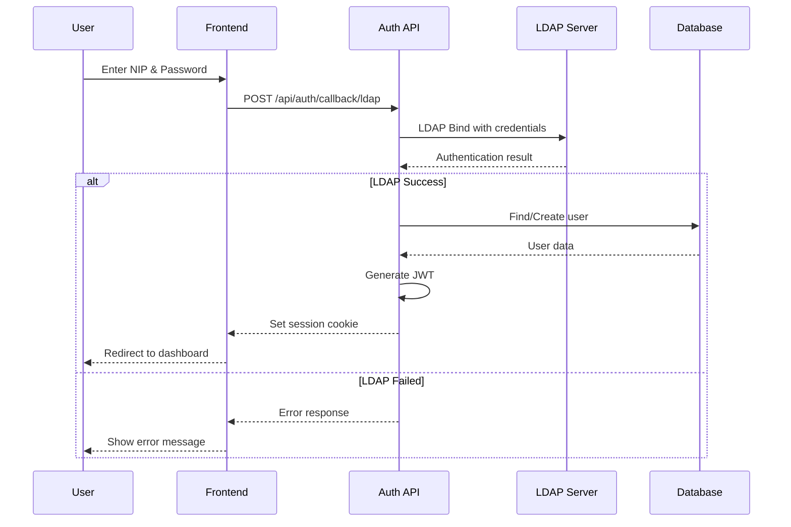
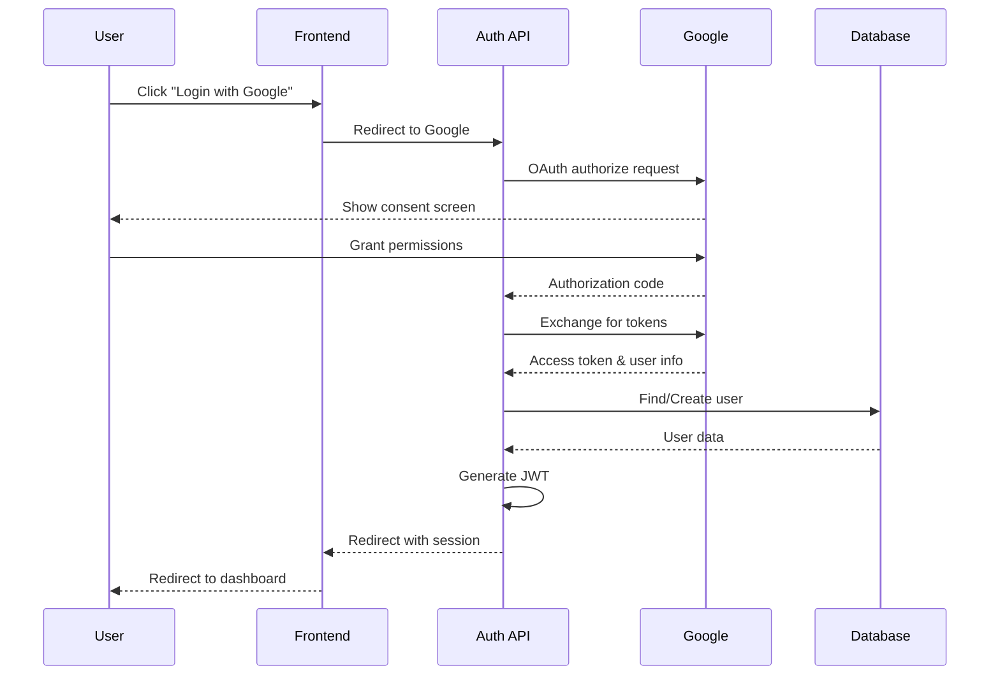
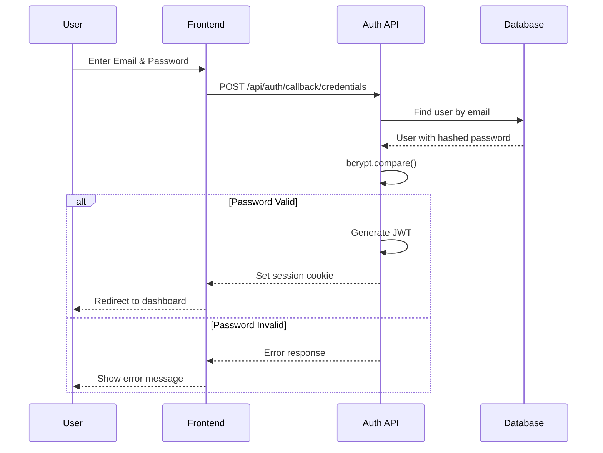
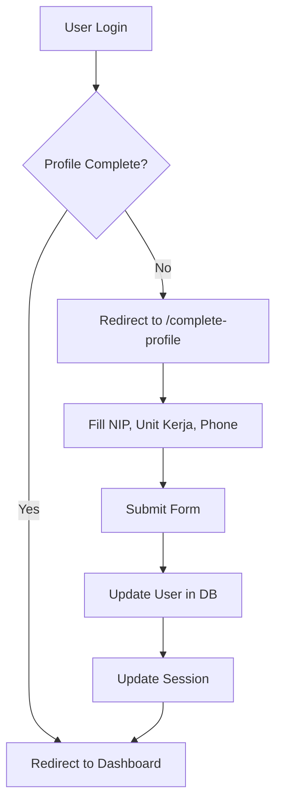

# Authentication - ULP ASN

Dokumen ini menjelaskan sistem autentikasi yang digunakan dalam aplikasi TITAN ULP.

---

## 📚 Gambaran Umum

ULP ASN mendukung multiple authentication methods:

1. **LDAP/Active Directory** - Untuk login ASN dengan NIP
2. **Google OAuth** - Social login dengan akun Google
3. **Credentials** - Email/password (untuk development/testing)

Sistem menggunakan **NextAuth.js v5** (Auth.js) dengan JWT session strategy.

---

## 🔧 Konfigurasi

### Environment Variables

```env
# WAJIB
AUTH_SECRET="your-super-secret-key-min-32-chars"
AUTH_URL="http://localhost:3001"

# Google OAuth (opsional)
GOOGLE_CLIENT_ID="your-google-client-id"
GOOGLE_CLIENT_SECRET="your-google-client-secret"

# LDAP (opsional)
LDAP_URL="ldap://ldap.example.go.id:389"
LDAP_BIND_DN="cn=admin,dc=example,dc=go,dc=id"
LDAP_BIND_PASSWORD="admin-password"
LDAP_SEARCH_BASE="ou=users,dc=example,dc=go,dc=id"
LDAP_SEARCH_FILTER="(uid={{username}})"
```

---

## 🔐 Auth Flow

### 1. LDAP Authentication



### 2. Google OAuth



### 3. Credentials (Database)



---

## 👤 Session Structure

### JWT Token

```typescript
interface JWT {
  id: string           // User ID
  sub: string          // User ID (subject)
  email: string
  name: string
  role: Role           // SUPER_ADMIN | ADMIN_UNIT | INSTRUCTOR | LEARNER
  nip?: string         // NIP ASN
  unitKerja?: string   // Unit kerja/instansi
  phone?: string
  iat: number          // Issued at
  exp: number          // Expiry
}
```

### Session Object

```typescript
interface Session {
  user: {
    id: string
    email: string
    name: string
    image?: string
    role: Role
    nip?: string
    unitKerja?: string
    phone?: string
  }
  expires: string      // ISO date string
}
```

---

## 🛠️ Auth Configuration

### File: `src/lib/auth.ts`

```typescript
import NextAuth from "next-auth"
import { PrismaAdapter } from "@auth/prisma-adapter"
import Google from "next-auth/providers/google"
import Credentials from "next-auth/providers/credentials"

export const { handlers, signIn, signOut, auth } = NextAuth({
  adapter: PrismaAdapter(prisma),
  session: { strategy: "jwt" },
  
  pages: {
    signIn: "/login",
    error: "/login",
  },
  
  providers: [
    // Google OAuth (if configured)
    Google({
      clientId: process.env.GOOGLE_CLIENT_ID,
      clientSecret: process.env.GOOGLE_CLIENT_SECRET,
      allowDangerousEmailAccountLinking: true,
    }),
    
    // LDAP / Credentials
    Credentials({
      id: "ldap",
      name: "LDAP",
      credentials: {
        username: { label: "Username", type: "text" },
        password: { label: "Password", type: "password" },
      },
      async authorize(credentials) {
        // 1. Try LDAP if configured
        // 2. Fallback to database credentials
      },
    }),
  ],
  
  callbacks: {
    jwt({ token, user }) {
      // Add custom fields to JWT
      if (user) {
        token.id = user.id
        token.role = user.role
        token.nip = user.nip
        token.unitKerja = user.unitKerja
      }
      return token
    },
    session({ session, token }) {
      // Add custom fields to session
      session.user.id = token.id
      session.user.role = token.role
      session.user.nip = token.nip
      session.user.unitKerja = token.unitKerja
      return session
    },
  },
})
```

---

## 🔑 Using Auth in Code

### Server Components

```typescript
import { auth } from "@/lib/auth"

export default async function DashboardPage() {
  const session = await auth()
  
  if (!session) {
    redirect("/login")
  }
  
  return (
    <div>
      <h1>Welcome, {session.user.name}</h1>
      <p>Role: {session.user.role}</p>
    </div>
  )
}
```

### Server Actions

```typescript
"use server"

import { auth } from "@/lib/auth"

export async function createCourse(data: CourseData) {
  const session = await auth()
  
  if (!session?.user) {
    return { error: "Unauthorized" }
  }
  
  if (!["INSTRUCTOR", "ADMIN_UNIT", "SUPER_ADMIN"].includes(session.user.role)) {
    return { error: "Forbidden" }
  }
  
  // ... create course logic
}
```

### Client Components

```typescript
"use client"

import { useSession } from "next-auth/react"

export function UserAvatar() {
  const { data: session, status } = useSession()
  
  if (status === "loading") {
    return <Skeleton />
  }
  
  if (!session) {
    return <LoginButton />
  }
  
  return (
    <Avatar>
      <AvatarImage src={session.user.image} />
      <AvatarFallback>{session.user.name?.[0]}</AvatarFallback>
    </Avatar>
  )
}
```

### Login/Logout

```typescript
"use client"

import { signIn, signOut } from "next-auth/react"

// Login with credentials
await signIn("ldap", {
  username: email,
  password: password,
  redirect: true,
  callbackUrl: "/dashboard"
})

// Login with Google
await signIn("google", {
  redirect: true,
  callbackUrl: "/dashboard"
})

// Logout
await signOut({ 
  redirect: true,
  callbackUrl: "/" 
})
```

---

## 🏢 LDAP Integration

### LDAP Configuration

```typescript
// src/lib/ldap.ts

import ldap from "ldapjs"

export async function authenticateWithLDAP(
  username: string,
  password: string
): Promise<LDAPUser | null> {
  const client = ldap.createClient({
    url: process.env.LDAP_URL!
  })
  
  // Bind with service account
  await bind(client, process.env.LDAP_BIND_DN!, process.env.LDAP_BIND_PASSWORD!)
  
  // Search for user
  const searchFilter = process.env.LDAP_SEARCH_FILTER!
    .replace("{{username}}", username)
  
  const users = await search(client, process.env.LDAP_SEARCH_BASE!, searchFilter)
  
  if (users.length === 0) {
    return null
  }
  
  const userDN = users[0].dn
  
  // Bind with user credentials
  try {
    await bind(client, userDN, password)
    
    return {
      nip: users[0].nip,
      email: users[0].mail,
      name: users[0].cn,
      unitKerja: users[0].ou,
      jabatan: users[0].title,
    }
  } catch {
    return null
  }
}
```

### LDAP User Mapping

| LDAP Attribute | User Field |
|----------------|------------|
| `uid` | `nip` |
| `mail` | `email` |
| `cn` | `name` |
| `ou` | `unitKerja` |
| `title` | `jabatan` |

---

## 🔐 Role-Based Access Control (RBAC)

### Roles

| Role | Description | Permissions |
|------|-------------|-------------|
| `SUPER_ADMIN` | Super administrator | Full access to everything |
| `ADMIN_UNIT` | Unit administrator | Manage users/courses in unit |
| `INSTRUCTOR` | Widyaiswara | Create/manage own courses |
| `LEARNER` | Peserta | Enroll and learn |

### Permission Matrix

| Action | LEARNER | INSTRUCTOR | ADMIN_UNIT | SUPER_ADMIN |
|--------|---------|------------|------------|-------------|
| View courses | ✅ | ✅ | ✅ | ✅ |
| Enroll | ✅ | ✅ | ✅ | ✅ |
| Create course | ❌ | ✅ | ✅ | ✅ |
| Manage users | ❌ | ❌ | ✅ (unit only) | ✅ |
| System settings | ❌ | ❌ | ❌ | ✅ |
| Audit logs | ❌ | ❌ | ✅ (unit only) | ✅ |

### Middleware Protection

```typescript
// middleware.ts
import { auth } from "@/lib/auth"

export default auth((req) => {
  const { pathname } = req.nextUrl
  
  // Protected routes
  if (pathname.startsWith("/dashboard")) {
    if (!req.auth) {
      return Response.redirect(new URL("/login", req.url))
    }
  }
  
  // Admin routes
  if (pathname.startsWith("/dashboard/admin")) {
    if (!["SUPER_ADMIN", "ADMIN_UNIT"].includes(req.auth?.user?.role)) {
      return Response.redirect(new URL("/dashboard", req.url))
    }
  }
})

export const config = {
  matcher: ["/dashboard/:path*"]
}
```

---

## 🔄 Session Update

Untuk update session setelah profile change:

```typescript
"use client"

import { useSession } from "next-auth/react"

export function ProfileForm() {
  const { update } = useSession()
  
  const handleSubmit = async (data) => {
    // Update profile in database
    await updateProfile(data)
    
    // Update session
    await update({
      name: data.name,
      nip: data.nip,
      unitKerja: data.unitKerja,
      phone: data.phone,
    })
  }
}
```

---

## 🛡️ Security Best Practices

### 1. Password Hashing

```typescript
import bcrypt from "bcryptjs"

// Hash password (during registration)
const hashedPassword = await bcrypt.hash(password, 10)

// Verify password (during login)
const isValid = await bcrypt.compare(inputPassword, hashedPassword)
```

### 2. Rate Limiting

Implementasi rate limiting untuk endpoint login menggunakan Redis:

```typescript
const MAX_ATTEMPTS = 5
const LOCKOUT_DURATION = 15 * 60 // 15 minutes

async function checkRateLimit(email: string) {
  const key = `login_attempts:${email}`
  const attempts = await redis.incr(key)
  
  if (attempts === 1) {
    await redis.expire(key, LOCKOUT_DURATION)
  }
  
  if (attempts > MAX_ATTEMPTS) {
    throw new Error("Too many login attempts. Please try again later.")
  }
}
```

### 3. Secure Cookies

```typescript
// next.config.ts
export default {
  // Force secure cookies in production
  experimental: {
    serverActions: {
      secureCookies: process.env.NODE_ENV === "production"
    }
  }
}
```

---

## 📱 Complete Profile Flow

Untuk user baru (terutama dari OAuth):



---

## 🔧 Troubleshooting

### "LDAP authentication failed"

1. Periksa koneksi ke LDAP server
2. Verifikasi LDAP_BIND_DN dan LDAP_BIND_PASSWORD
3. Periksa LDAP_SEARCH_FILTER syntax

### "Session not persisting"

1. Pastikan AUTH_SECRET sudah di-set
2. Periksa cookie domain settings
3. Untuk Docker: set SECURE_COOKIES=false untuk development

### "Google OAuth callback error"

1. Verifikasi redirect URI di Google Console
2. Pastikan domain sesuai dengan AUTH_URL
3. Periksa GOOGLE_CLIENT_ID dan GOOGLE_CLIENT_SECRET

---

*Dokumen ini terakhir diperbarui: 27 Januari 2026*
