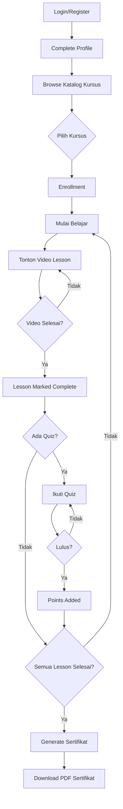
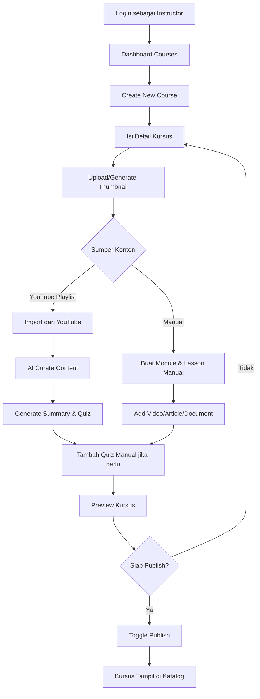
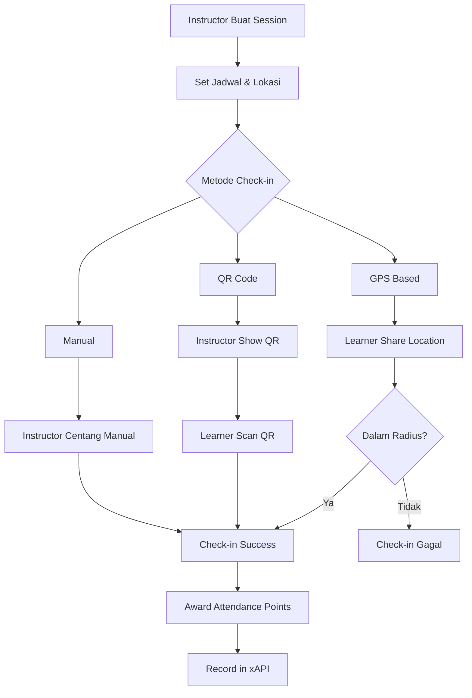

# Analisis Proses Bisnis Aplikasi TITAN ULP

## Gambaran Umum

TITAN adalah Learning Experience Platform (ULP) untuk Aparatur Sipil Negara (ASN) yang mendukung berbagai mode pembelajaran: **Classroom**, **Hybrid**, **Live Online**, dan **Self-Paced**.

---

## 1. Struktur Peran Pengguna

| Role | Akses | Deskripsi |
|------|-------|-----------|
| **SUPER_ADMIN** | Penuh | Kelola semua user, kursus, pengaturan sistem, audit logs |
| **ADMIN_UNIT** | Unit Kerja | Kelola user dan kursus dalam unit kerjanya |
| **INSTRUCTOR** | Mengajar | Buat kursus, kelola konten, lihat progress siswa |
| **LEARNER** | Belajar | Enroll kursus, ikuti pembelajaran, ikut kuis |

---

## 2. Alur Proses Utama

### 2.1 Alur Pembelajaran (Learner Journey)

### 2.2 Alur Pembuatan Kursus (Instructor Journey)

### 2.3 Alur Sesi Tatap Muka (Attendance Flow)

---

## 3. Sistem Gamifikasi

### 3.1 Skema Poin

| Aksi | Poin |
|------|------|
| Menyelesaikan 1 Lesson | +10 |
| Lulus Quiz | +30 |
| Menyelesaikan Kursus | +100 |
| Daily Login | +5 |
| Hadir di Sesi | +20 |

### 3.2 Level System
- Setiap **200 poin** = naik 1 level
- Badge otomatis diberikan saat mencapai milestone tertentu

### 3.3 Leaderboard
- Ranking berdasarkan total poin
- Filter by Unit Kerja untuk kompetisi internal

---

## 4. Tracking & Analytics (xAPI)

### 4.1 Event yang Ditrack

| Event | Verb xAPI | Kapan Terjadi |
|-------|-----------|---------------|
| Enrollment | `registered` | User enroll kursus |
| Video Play | `played` | Video mulai diputar |
| Video Pause | `paused` | Video di-pause |
| Video Complete | `completed` | Video selesai |
| Lesson Complete | `completed` | Lesson ditandai selesai |
| Quiz Passed | `passed` | Quiz lulus (>= passing score) |
| Quiz Failed | `failed` | Quiz tidak lulus |
| Certificate Earned | `earned` | Sertifikat diterbitkan |

### 4.2 Data Analytics
- Dashboard admin untuk melihat statistik real-time
- Trend aktivitas harian/mingguan/bulanan
- Popular courses berdasarkan enrollment

---

## 5. Mode Pembelajaran

| Mode | Deskripsi | Fitur Terkait |
|------|-----------|---------------|
| **CLASSROOM** | 100% tatap muka | QR/GPS check-in, manual attendance |
| **HYBRID** | Kombinasi online + tatap muka | Video lessons + scheduled sessions |
| **LIVE_ONLINE** | Kelas virtual langsung | Zoom integration (planned) |
| **SELF_PACED** | Belajar mandiri kapan saja | Video lessons, quiz, auto-completion |

---

## 6. Proses Sertifikasi

### Syarat Mendapat Sertifikat:
1. ✅ 100% lessons completed
2. ✅ Semua quiz lulus (jika ada)
3. ✅ Attendance memenuhi threshold (untuk classroom/hybrid)

### Output Sertifikat:
- PDF dengan desain formal
- QR Code untuk verifikasi
- Nomor sertifikat unik
- Verification URL publik

---

## 7. Peran Admin

### SUPER_ADMIN:
- Manajemen semua user (role, status)
- Audit logs sistem
- System settings
- xAPI analytics
- Platform reports

### ADMIN_UNIT:
- Kelola user dalam unit kerjanya saja
- Lihat progress learner di unitnya
- Limited audit logs (hanya unit)

---

## 8. Identifikasi Gap & Perbaikan

### ❌ Proses yang Belum Lengkap:

| No | Proses | Status | Catatan |
|----|--------|--------|---------|
| 1 | Zoom Integration | ⏳ Planned | Untuk LIVE_ONLINE sessions |
| 2 | Forum Diskusi | 🟡 Basic | Ada tapi minimal fitur |
| 3 | Reminder/Notifikasi | ⏳ Basic | Perlu email/WhatsApp integration |
| 4 | Learning Path | ❌ Belum | Urutan kursus yang direkomendasikan |
| 5 | Approval Workflow | ❌ Belum | Untuk enrollment yang butuh approval |
| 6 | Reporting to HR | ⏳ Basic | Export data untuk keperluan SDM |
| 7 | Pre-Test/Post-Test | 🟡 Partial | Quiz ada, tapi belum ada pembanding |

### ✅ Proses yang Sudah Berjalan Baik:
- Self-paced learning flow
- Course creation & publishing
- Quiz system dengan auto-grading
- Certificate generation & verification
- Gamification (points, levels)
- xAPI tracking & analytics
- Attendance (QR, GPS, manual)

---

## 9. Rekomendasi Prioritas

### Prioritas Tinggi:
1. **Learning Path** - Guideline urutan kursus untuk kompetensi tertentu
2. **Notification System** - Email/WhatsApp reminder untuk deadline
3. **Pre/Post Test Comparison** - Untuk mengukur efektivitas pelatihan

### Prioritas Menengah:
4. **Approval Workflow** - Untuk kursus yang butuh persetujuan atasan
5. **HR Reporting** - Export data ke format SDM standar
6. **Forum Enhancement** - Q&A per lesson, @mention, upvote

### Prioritas Rendah:
7. **Zoom Integration** - Jika ada kebutuhan live online
8. **Social Learning** - Share progress, badges ke sosmed

---

*Dokumen ini berdasarkan analisis kode sumber per 21 Januari 2026*
