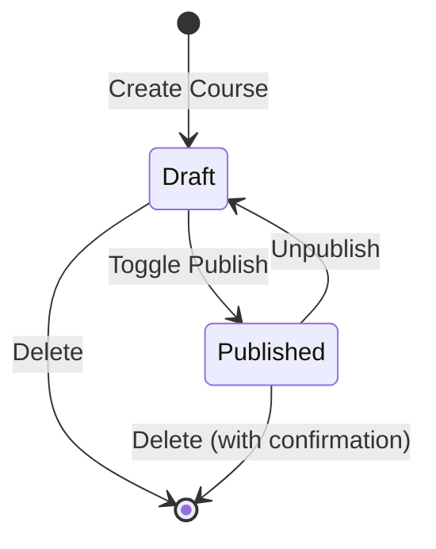
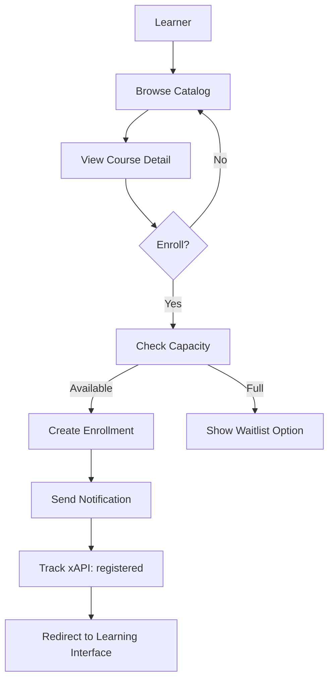

# Course Management - ULP ASN

Dokumen ini menjelaskan fitur manajemen kursus dalam aplikasi TITAN ULP.

---

## 📚 Gambaran Umum

Course Management memungkinkan Instructor dan Admin untuk membuat, mengelola, dan mempublikasikan kursus pelatihan ASN.

---

## 🎯 Delivery Modes

ULP ASN mendukung 4 mode pembelajaran:

### 1. ON_CLASSROOM (Tatap Muka)

**100% pelatihan offline di kelas fisik**

- **Fitur:** QR check-in, GPS validation, manual attendance
- **Use Cases:** Workshop teknis, praktikum, pelatihan hands-on
- **Attendance:** Wajib hadir fisik

### 2. HYBRID (Blended Learning)

**Kombinasi online + offline**

- **Komponen:** E-learning + Sesi tatap muka
- **Use Cases:** Flipped classroom, rotasi mingguan
- **Attendance:** Track keduanya (online progress + physical attendance)

> **PENTING:** HYBRID harus mencakup kedua komponen. Jika hanya salah satu, gunakan mode yang sesuai.

### 3. ASYNC_ONLINE (E-Learning Mandiri)

**100% pembelajaran online mandiri**

- **Platform:** Video on-demand, modul interaktif, quiz online
- **Use Cases:** Kursus teori, tutorial software, persiapan ujian
- **Attendance:** Progress tracking otomatis

### 4. SYNC_ONLINE (Live Online)

**100% sesi online langsung dengan jadwal tetap**

- **Platform:** Zoom, YouTube Live, Instagram Live, TikTok Live
- **Use Cases:** Webinar, kuliah online, town hall meeting
- **Attendance:** Zoom auto-tracking atau manual check-in

---

## 📝 Membuat Kursus Baru

### Via Dashboard

1. Login sebagai **Instructor** atau **Admin**
2. Navigasi ke **Dashboard** → **Courses**
3. Klik tombol **"+ Buat Kursus Baru"**
4. Isi form:
   - Judul kursus
   - Deskripsi lengkap
   - Delivery mode
   - Tingkat kesulitan
   - Kategori
   - Durasi estimasi
5. Upload atau generate thumbnail
6. Klik **"Simpan"**

### Via YouTube Playlist Import

1. Navigasi ke **Dashboard** → **Courses** → **Import dari YouTube**
2. Paste URL YouTube Playlist
3. Sistem akan:
   - Fetch metadata playlist
   - Create course dengan video sebagai lessons
   - Generate AI summary & thumbnail
4. Review dan edit sesuai kebutuhan
5. Publish ketika siap

---

## 🏗️ Struktur Kursus

```
Course
├── Course Info (title, description, thumbnail, etc.)
├── Module 1
│   ├── Lesson 1.1 (Video)
│   ├── Lesson 1.2 (Text/Document)
│   └── Quiz 1
├── Module 2
│   ├── Lesson 2.1 (Video)
│   ├── Lesson 2.2 (Video)
│   └── Quiz 2
└── Final Exam (Quiz)
```

### Komponen

| Komponen | Deskripsi |
|----------|-----------|
| **Course** | Container utama dengan metadata |
| **Module** | Grup logical untuk lessons |
| **Lesson** | Konten pembelajaran (video, text, file) |
| **Quiz** | Assessment untuk module |

---

## 📹 Content Types

### Video Lesson

```typescript
{
  contentType: "VIDEO",
  videoUrl: "https://youtube.com/watch?v=...",
  ytVideoId: "dQw4w9WgXcQ",
  duration: 300  // in seconds
}
```

**Supported Platforms:**
- YouTube
- Vimeo
- Direct MP4 links

### Text/Article Lesson

```typescript
{
  contentType: "TEXT",
  content: "# Markdown content here\n\n..."
}
```

Mendukung **Markdown** dengan:
- Headings
- Lists
- Code blocks
- Images
- Tables

### Document Lesson

```typescript
{
  contentType: "DOCUMENT",
  fileUrl: "https://minio/path/to/document.pdf"
}
```

**Supported Files:**
- PDF
- Word (.docx)
- PowerPoint (.pptx)
- Excel (.xlsx)

### SCORM Package

```typescript
{
  contentType: "SCORM",
  scormUrl: "https://minio/path/to/scorm/index.html"
}
```

### External Link

```typescript
{
  contentType: "EXTERNAL",
  externalUrl: "https://external-platform.com/resource"
}
```

---

## 🔄 Course Lifecycle



### Status

| Status | Visibility | Enrollments |
|--------|------------|-------------|
| **Draft** | Instructor only | Disabled |
| **Published** | Public catalog | Enabled |

---

## 👥 Enrollment

### Enrollment Flow



### Enrollment Status

| Status | Description |
|--------|-------------|
| `ENROLLED` | Baru enroll, belum mulai |
| `IN_PROGRESS` | Sedang belajar |
| `COMPLETED` | Selesai 100% |
| `DROPPED` | Berhenti/keluar |

### Enrollment Actions

```typescript
// Enroll in course
await enrollInCourse(courseId)

// Get user enrollments
const { enrollments } = await getUserEnrollments()

// Update enrollment status
await updateEnrollmentStatus(enrollmentId, "COMPLETED")
```

---

## 📊 Progress Tracking

### Lesson Progress

```typescript
interface LessonProgress {
  lessonId: string
  isCompleted: boolean
  watchedSeconds?: number    // For video
  lastPosition?: number      // Video position
  startedAt: Date
  completedAt?: Date
}
```

### Course Progress Calculation

```
courseProgress = (completedLessons / totalLessons) * 100
```

### Completion Requirements

Untuk menyelesaikan kursus:

1. ✅ Semua lessons completed (100%)
2. ✅ Semua quiz lulus (score >= passing score)
3. ✅ Attendance memenuhi threshold (untuk CLASSROOM/HYBRID)

---

## 🖼️ Thumbnail Management

### AI Generation

```typescript
// Generate thumbnail dengan AI
const result = await fetch("/api/generate-thumbnail", {
  method: "POST",
  body: JSON.stringify({
    title: "Course Title",
    description: "Course description...",
    style: "professional"
  })
})
```

### Upload Manual

```typescript
// Update course thumbnail
await updateCourseThumbnail(courseId, thumbnailUrl)
```

### Default Images

Jika tidak ada thumbnail, sistem menampilkan placeholder berdasarkan:
- Category icon
- Delivery mode badge
- Generic course image

---

## 🔧 Course Settings

### Basic Settings

| Setting | Description |
|---------|-------------|
| `title` | Judul kursus (min 3 karakter) |
| `description` | Deskripsi lengkap (min 10 karakter) |
| `courseShortDesc` | Deskripsi singkat (max 500 karakter) |
| `difficulty` | BEGINNER / INTERMEDIATE / ADVANCED |
| `deliveryMode` | Mode pembelajaran |
| `category` | Kategori kursus |

### Scheduling

| Setting | Description |
|---------|-------------|
| `duration` | Durasi estimasi (menit) |
| `startDate` | Tanggal mulai (opsional) |
| `endDate` | Tanggal berakhir (opsional) |
| `capacity` | Kapasitas maksimal peserta |

### Advanced

| Setting | Description |
|---------|-------------|
| `isPublished` | Status publikasi |
| `ytPlaylistId` | ID YouTube Playlist (jika import) |
| `syncConfig` | Konfigurasi Sync Course |

---

## 📋 Module Management

### Create Module

```typescript
await createModule({
  courseId: "course-id",
  title: "Module Title",
  description: "Module description",
  order: 1,
  duration: 60  // minutes
})
```

### Reorder Modules

```typescript
await reorderModules(courseId, [
  { id: "module-1", order: 1 },
  { id: "module-2", order: 2 },
  { id: "module-3", order: 3 },
])
```

### Delete Module

```typescript
await deleteModule(moduleId)
// Warning: Ini akan menghapus semua lessons dalam module
```

---

## 📝 Lesson Management

### Create Lesson

```typescript
await createLesson({
  moduleId: "module-id",
  title: "Lesson Title",
  description: "Lesson description",
  contentType: "VIDEO",
  videoUrl: "https://youtube.com/watch?v=...",
  order: 1
})
```

### Reorder Lessons

```typescript
await reorderLessons(moduleId, [
  { id: "lesson-1", order: 1 },
  { id: "lesson-2", order: 2 },
])
```

---

## 📤 Publishing

### Pre-publish Checklist

Sebelum publish, pastikan:

- [ ] Course memiliki minimal 1 module
- [ ] Setiap module memiliki minimal 1 lesson
- [ ] Thumbnail sudah di-set
- [ ] Deskripsi lengkap dan jelas
- [ ] Instructor sudah di-assign

### Toggle Publish

```typescript
const result = await toggleCoursePublish(courseId)

if (result.success) {
  console.log(`Course is now ${result.isPublished ? "published" : "draft"}`)
}
```

### Publish Notifications

Ketika kursus dipublish:
1. Course muncul di katalog publik
2. Notification dikirim ke subscribers (jika ada)
3. xAPI statement: course published

---

## 🔍 Course Filtering

### Filter Options

```typescript
const { courses } = await getCourses({
  deliveryMode: "ASYNC_ONLINE",
  difficulty: "BEGINNER",
  category: "leadership",
  isPublished: true,
  limit: 12,
  offset: 0
})
```

### Search

```typescript
const { courses } = await searchCourses({
  query: "kepemimpinan digital",
  filters: {
    deliveryMode: ["ASYNC_ONLINE", "HYBRID"],
    difficulty: ["BEGINNER", "INTERMEDIATE"]
  }
})
```

---

## 📊 Analytics

### Course Statistics

```typescript
const stats = await getCourseStats(courseId)

// Returns:
{
  totalEnrollments: 150,
  completedEnrollments: 45,
  averageProgress: 67.5,
  averageQuizScore: 78.2,
  certificatesIssued: 45
}
```

### Popular Courses

```typescript
const { courses } = await getPopularCourses({
  limit: 10,
  period: "monthly"
})
```

---

## 🔐 Permissions

### Who Can Do What

| Action | LEARNER | INSTRUCTOR | ADMIN_UNIT | SUPER_ADMIN |
|--------|---------|------------|------------|-------------|
| View catalog | ✅ | ✅ | ✅ | ✅ |
| Enroll | ✅ | ✅ | ✅ | ✅ |
| Create course | ❌ | ✅ | ✅ | ✅ |
| Edit own course | ❌ | ✅ | ✅ | ✅ |
| Edit any course | ❌ | ❌ | ✅ (unit) | ✅ |
| Delete course | ❌ | ✅ (own) | ✅ (unit) | ✅ |
| Publish course | ❌ | ✅ (own) | ✅ (unit) | ✅ |

---

## 📱 API Reference

### Server Actions

| Function | Description |
|----------|-------------|
| `getCourses(filters?)` | Get courses with filters |
| `getCourseBySlug(slug)` | Get course by slug |
| `createCourse(data)` | Create new course |
| `updateCourse(id, data)` | Update course |
| `deleteCourse(id)` | Delete course |
| `toggleCoursePublish(id)` | Toggle publish status |
| `enrollInCourse(id)` | Enroll in course |
| `getUserEnrollments()` | Get user's enrollments |
| `getUserCreatedCourses()` | Get instructor's courses |

---

*Dokumen ini terakhir diperbarui: 27 Januari 2026*
