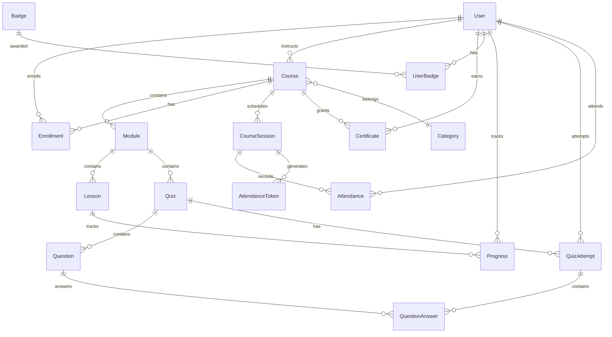

# Database Schema - ULP ASN

Dokumen ini menjelaskan struktur database dan model Prisma yang digunakan dalam aplikasi TITAN ULP.

---

## 📊 Gambaran Umum

Aplikasi menggunakan **PostgreSQL** sebagai database utama dengan **Prisma ORM** untuk akses data.

```
┌─────────────────────────────────────────────────────────────┐
│                      CORE ENTITIES                           │
├──────────────┬──────────────┬──────────────┬───────────────┤
│     User     │    Course    │    Module    │    Lesson     │
├──────────────┼──────────────┼──────────────┼───────────────┤
│  LEARNER     │  Delivery    │  Ordering    │  Content      │
│  INSTRUCTOR  │  Mode        │  Duration    │  Video/Text   │
│  ADMIN       │  Published   │              │               │
└──────────────┴──────────────┴──────────────┴───────────────┘
                               │
        ┌──────────────────────┼──────────────────────┐
        ▼                      ▼                      ▼
┌──────────────┐      ┌──────────────┐      ┌──────────────┐
│  Enrollment  │      │     Quiz     │      │ Certificate  │
│  Progress    │      │   Question   │      │              │
│              │      │   Attempt    │      │              │
└──────────────┘      └──────────────┘      └──────────────┘
```

---

## 👤 User & Authentication

### User

Tabel utama untuk semua pengguna sistem.

```prisma
model User {
  id            String         @id @default(cuid())
  nip           String?        @unique    // NIP ASN
  email         String         @unique
  name          String?
  password      String?                   // Hashed password
  image         String?
  emailVerified DateTime?
  role          Role           @default(LEARNER)
  status        UserStatus     @default(ACTIVE)
  
  // ASN-specific fields
  unitKerja     String?
  jabatan       String?
  phone         String?
  
  // Gamification
  points        Int            @default(0)
  level         Int            @default(1)
  streak        Int            @default(0)
  lastActiveAt  DateTime?
  
  // Relations
  enrollments   Enrollment[]
  courses       Course[]       // As instructor
  certificates  Certificate[]
  badges        UserBadge[]
  // ... more relations
}

enum Role {
  SUPER_ADMIN
  ADMIN_UNIT
  INSTRUCTOR
  LEARNER
}

enum UserStatus {
  ACTIVE
  INACTIVE
  SUSPENDED
}
```

### Account

Untuk OAuth accounts (NextAuth.js).

```prisma
model Account {
  id                String  @id @default(cuid())
  userId            String
  type              String
  provider          String
  providerAccountId String
  refresh_token     String?
  access_token      String?
  expires_at        Int?
  token_type        String?
  scope             String?
  id_token          String?
  session_state     String?

  User User @relation(fields: [userId], references: [id], onDelete: Cascade)

  @@unique([provider, providerAccountId])
}
```

### Session

Untuk session management.

```prisma
model Session {
  id           String   @id @default(cuid())
  sessionToken String   @unique
  userId       String
  expires      DateTime
  user         User     @relation(fields: [userId], references: [id], onDelete: Cascade)
}
```

---

## 📚 Course Management

### Course

```prisma
model Course {
  id            String          @id
  title         String
  slug          String          @unique
  description   String
  thumbnail     String?
  deliveryMode  DeliveryMode    @default(ASYNC_ONLINE)
  difficulty    Difficulty      @default(BEGINNER)
  isPublished   Boolean         @default(false)
  
  // Metadata
  duration      Int?            // In minutes
  capacity      Int?
  startDate     DateTime?
  endDate       DateTime?
  
  // YouTube Integration
  ytPlaylistId      String?     @unique
  isProcessing      Boolean     @default(false)
  processingStatus  String?
  lastProcessedAt   DateTime?
  
  // Sync Course Configuration
  syncConfig        Json?
  
  // Relations
  instructorId  String
  categoryId    String?
  instructor    User            @relation(fields: [instructorId], references: [id])
  category      Category?       @relation(fields: [categoryId], references: [id])
  modules       Module[]
  enrollments   Enrollment[]
  sessions      CourseSession[]
  certificates  Certificate[]
}

enum DeliveryMode {
  ON_CLASSROOM     // Tatap muka
  HYBRID           // Kombinasi
  ASYNC_ONLINE     // E-learning mandiri
  SYNC_ONLINE      // Live online
}

enum Difficulty {
  BEGINNER
  INTERMEDIATE
  ADVANCED
}
```

### Module

```prisma
model Module {
  id          String   @id
  courseId    String
  title       String
  description String?
  order       Int
  duration    Int?     // In minutes
  createdAt   DateTime @default(now())
  updatedAt   DateTime @updatedAt
  
  course      Course   @relation(fields: [courseId], references: [id], onDelete: Cascade)
  lessons     Lesson[]
  quizzes     Quiz[]
}
```

### Lesson

```prisma
model Lesson {
  id          String      @id
  moduleId    String
  title       String
  description String?
  order       Int
  contentType ContentType
  
  // Content fields (based on contentType)
  content     String?     // For TEXT/DOCUMENT
  videoUrl    String?     // For VIDEO
  ytVideoId   String?     // YouTube video ID
  fileUrl     String?     // For FILE
  scormUrl    String?     // For SCORM
  externalUrl String?     // For EXTERNAL
  
  // Metadata
  duration    Int?        // In seconds
  createdAt   DateTime    @default(now())
  updatedAt   DateTime    @updatedAt
  
  module      Module      @relation(fields: [moduleId], references: [id], onDelete: Cascade)
  progress    Progress[]
}

enum ContentType {
  VIDEO
  TEXT
  DOCUMENT
  QUIZ
  SCORM
  EXTERNAL
}
```

### Category

```prisma
model Category {
  id          String   @id @default(cuid())
  name        String
  slug        String   @unique
  icon        String?
  description String?
  order       Int      @default(0)
  createdAt   DateTime @default(now())
  updatedAt   DateTime @updatedAt
  
  courses     Course[]
}
```

---

## 📝 Enrollment & Progress

### Enrollment

```prisma
model Enrollment {
  id        String           @id
  userId    String
  courseId  String
  status    EnrollmentStatus @default(ENROLLED)
  progress  Float            @default(0)
  
  enrolledAt    DateTime     @default(now())
  startedAt     DateTime?
  completedAt   DateTime?
  
  user      User             @relation(fields: [userId], references: [id], onDelete: Cascade)
  course    Course           @relation(fields: [courseId], references: [id], onDelete: Cascade)

  @@unique([userId, courseId])
}

enum EnrollmentStatus {
  ENROLLED
  IN_PROGRESS
  COMPLETED
  DROPPED
}
```

### Progress

```prisma
model Progress {
  id          String    @id
  userId      String
  lessonId    String
  isCompleted Boolean   @default(false)
  
  // Video progress
  watchedSeconds Int?
  lastPosition   Int?
  
  startedAt   DateTime  @default(now())
  completedAt DateTime?
  
  user        User      @relation(fields: [userId], references: [id], onDelete: Cascade)
  lesson      Lesson    @relation(fields: [lessonId], references: [id], onDelete: Cascade)

  @@unique([userId, lessonId])
}
```

---

## 📋 Assessment (Quiz)

### Quiz

```prisma
model Quiz {
  id           String      @id
  moduleId     String
  title        String
  description  String?
  type         QuizType    @default(POST_TEST)
  passingScore Int         @default(70)
  timeLimit    Int?        // In minutes
  maxAttempts  Int?
  shuffleQuestions Boolean @default(false)
  showCorrectAnswers Boolean @default(true)
  
  createdAt    DateTime    @default(now())
  updatedAt    DateTime    @updatedAt
  
  module       Module      @relation(fields: [moduleId], references: [id], onDelete: Cascade)
  questions    Question[]
  attempts     QuizAttempt[]
}

enum QuizType {
  PRE_TEST
  POST_TEST
  KNOWLEDGE_CHECK
}
```

### Question

```prisma
model Question {
  id           String       @id
  quizId       String
  type         QuestionType
  content      String       // Question text
  explanation  String?      // Explanation for correct answer
  order        Int
  points       Float        @default(1)
  
  options      Json?        // For MC/TF: [{text, isCorrect}]
  rubric       Json?        // For Essay: grading rubric
  modelAnswer  String?      // For Essay: model answer
  
  quiz         Quiz         @relation(fields: [quizId], references: [id], onDelete: Cascade)
  answers      QuestionAnswer[]
}

enum QuestionType {
  MULTIPLE_CHOICE
  TRUE_FALSE
  ESSAY
  SHORT_ANSWER
}
```

### QuizAttempt

```prisma
model QuizAttempt {
  id          String    @id
  userId      String
  quizId      String
  
  startedAt   DateTime  @default(now())
  submittedAt DateTime?
  
  score       Float?
  isPassed    Boolean?
  
  user        User      @relation(fields: [userId], references: [id], onDelete: Cascade)
  quiz        Quiz      @relation(fields: [quizId], references: [id], onDelete: Cascade)
  answers     QuestionAnswer[]
}
```

### QuestionAnswer

```prisma
model QuestionAnswer {
  id              String      @id
  attemptId       String
  questionId      String
  
  answer          String?     // For essay/short answer
  selectedOptions Json?       // For MC/TF: [index]
  
  isCorrect       Boolean?
  pointsEarned    Float?
  aiFeedback      String?     // AI grading feedback
  
  attempt         QuizAttempt @relation(fields: [attemptId], references: [id], onDelete: Cascade)
  question        Question    @relation(fields: [questionId], references: [id], onDelete: Cascade)
}
```

---

## 📅 Sessions & Attendance

### CourseSession

```prisma
model CourseSession {
  id              String        @id
  courseId        String
  title           String
  description     String?
  type            SessionType
  
  startTime       DateTime
  endTime         DateTime
  
  // Location (for classroom)
  location        String?
  latitude        Float?
  longitude       Float?
  radius          Int?          // In meters
  
  // Online (for sync online)
  zoomMeetingId   String?
  zoomJoinUrl     String?
  streamUrl       String?
  
  course          Course        @relation(fields: [courseId], references: [id], onDelete: Cascade)
  attendance      Attendance[]
  tokens          AttendanceToken[]
}

enum SessionType {
  CLASSROOM
  ZOOM
  YOUTUBE_LIVE
  INSTAGRAM_LIVE
  TIKTOK_LIVE
}
```

### Attendance

```prisma
model Attendance {
  id            String           @id
  sessionId     String
  userId        String
  status        AttendanceStatus @default(PRESENT)
  
  checkInTime   DateTime         @default(now())
  checkInMethod CheckInMethod
  
  // GPS data
  latitude      Float?
  longitude     Float?
  
  notes         String?
  
  session       CourseSession    @relation(fields: [sessionId], references: [id], onDelete: Cascade)
  user          User             @relation(fields: [userId], references: [id], onDelete: Cascade)

  @@unique([sessionId, userId])
}

enum AttendanceStatus {
  PRESENT
  LATE
  ABSENT
  EXCUSED
}

enum CheckInMethod {
  QR_CODE
  GPS
  MANUAL
  ZOOM_AUTO
}
```

### AttendanceToken

```prisma
model AttendanceToken {
  id            String        @id
  sessionId     String
  token         String        @unique
  expiresAt     DateTime
  createdAt     DateTime      @default(now())
  
  session       CourseSession @relation(fields: [sessionId], references: [id], onDelete: Cascade)
}
```

---

## 🏆 Gamification

### Badge

```prisma
model Badge {
  id          String     @id
  name        String
  description String?
  icon        String?
  type        BadgeType
  criteria    Json?      // Criteria to earn
  
  users       UserBadge[]
}

enum BadgeType {
  ACHIEVEMENT
  MILESTONE
  SPECIAL
}
```

### UserBadge

```prisma
model UserBadge {
  id        String   @id
  userId    String
  badgeId   String
  earnedAt  DateTime @default(now())
  
  user      User     @relation(fields: [userId], references: [id], onDelete: Cascade)
  badge     Badge    @relation(fields: [badgeId], references: [id], onDelete: Cascade)

  @@unique([userId, badgeId])
}
```

---

## 📜 Certificate

```prisma
model Certificate {
  id               String   @id
  userId           String
  courseId         String
  
  certificateNo    String   @unique
  verificationCode String   @unique
  
  issuedAt         DateTime @default(now())
  expiresAt        DateTime?
  
  pdfUrl           String?
  
  user             User     @relation(fields: [userId], references: [id], onDelete: Cascade)
  course           Course   @relation(fields: [courseId], references: [id], onDelete: Cascade)
}
```

---

## 📊 Analytics & Audit

### Notification

```prisma
model Notification {
  id        String           @id
  userId    String
  type      NotificationType
  title     String
  message   String
  link      String?
  isRead    Boolean          @default(false)
  readAt    DateTime?
  createdAt DateTime         @default(now())
  
  user      User             @relation(fields: [userId], references: [id], onDelete: Cascade)
}

enum NotificationType {
  COURSE_ENROLLED
  COURSE_COMPLETED
  QUIZ_GRADED
  BADGE_EARNED
  CERTIFICATE_ISSUED
  SESSION_REMINDER
  SYSTEM
}
```

### SystemSetting

```prisma
model SystemSetting {
  id        String   @id
  key       String   @unique
  value     String
  updatedAt DateTime
}
```

---

## 🔗 Entity Relationships



---

## 📝 Prisma Commands

```bash
# Generate Prisma Client
npx prisma generate

# Push schema to database (development)
npx prisma db push

# Create migration
npx prisma migrate dev --name "migration_name"

# Apply migrations (production)
npx prisma migrate deploy

# Open Prisma Studio
npx prisma studio

# Reset database
npx prisma db push --force-reset
```

---

*Dokumen ini terakhir diperbarui: 27 Januari 2026*
