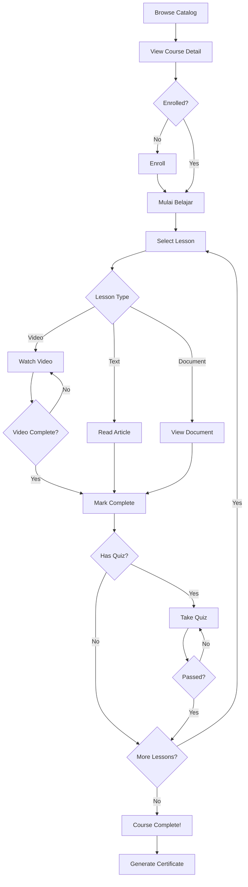
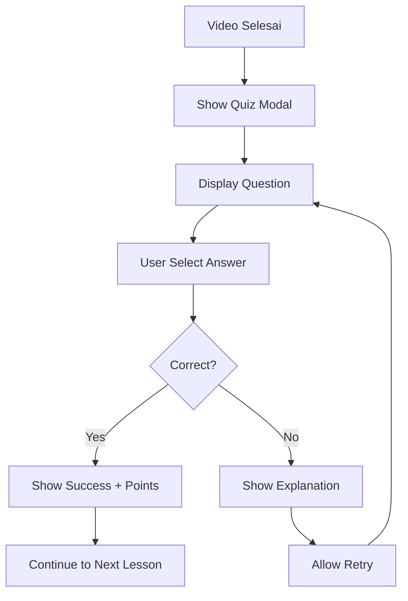

# Learning Interface - ULP ASN

Dokumen ini menjelaskan pengalaman pembelajaran (learning experience) untuk peserta dalam aplikasi TITAN ULP.

---

## 📚 Gambaran Umum

Learning Interface adalah antarmuka dimana Learner mengakses dan menyelesaikan kursus. Interface dirancang untuk memaksimalkan fokus dan engagement peserta.

---

## 🎯 User Flow



---

## 🖥️ Interface Layout

### Desktop Layout

```
┌─────────────────────────────────────────────────────────────────┐
│                        Header (Fixed)                            │
├──────────────────┬──────────────────────────────────────────────┤
│                  │                                               │
│    Sidebar       │              Content Area                     │
│    (Modules &    │                                               │
│     Lessons)     │        Video Player / Content                 │
│                  │                                               │
│    ▶ Module 1    │                                               │
│      ├ Lesson 1  │                                               │
│      ├ Lesson 2  │        ──────────────────────                 │
│      └ Quiz      │                                               │
│    ▶ Module 2    │        Lesson Info & Actions                  │
│      ├ Lesson 3  │                                               │
│      └ Lesson 4  │        [ Mark Complete ] [ Next Lesson ]      │
│                  │                                               │
├──────────────────┴──────────────────────────────────────────────┤
│                       Progress Bar                               │
└─────────────────────────────────────────────────────────────────┘
```

### Mobile Layout

```
┌───────────────────────────┐
│         Header            │
├───────────────────────────┤
│                           │
│      Video Player         │
│      / Content            │
│                           │
├───────────────────────────┤
│    Lesson Title           │
│    [ Mark Complete ]      │
├───────────────────────────┤
│    Modules (Collapsible)  │
│    ▶ Module 1             │
│    ▶ Module 2             │
├───────────────────────────┤
│    Progress: 45%          │
└───────────────────────────┘
```

---

## 📹 Video Player

### Features

- **Autoplay** - Video mulai otomatis saat lesson diklik
- **Progress Tracking** - Posisi tersimpan untuk melanjutkan
- **Speed Control** - 0.5x, 1x, 1.5x, 2x
- **Quality Selection** - Auto atau manual (untuk YouTube)
- **Fullscreen** - Mode layar penuh
- **Picture-in-Picture** - Tonton sambil scroll

### Video Events Tracking

```typescript
// Events yang di-track
onPlay()      // Video mulai diputar
onPause()     // Video di-pause
onSeek()      // User skip ke posisi lain
onProgress()  // Update posisi setiap 5 detik
onComplete()  // Video selesai (>=90% watched)
```

### xAPI Statements

| Event | Verb |
|-------|------|
| Play | `https://w3id.org/xapi/video/verbs/played` |
| Pause | `https://w3id.org/xapi/video/verbs/paused` |
| Seek | `https://w3id.org/xapi/video/verbs/seeked` |
| Complete | `http://adlnet.gov/expapi/verbs/completed` |

---

## 📖 Text/Article Content

### Markdown Support

Konten teks mendukung Markdown dengan fitur:

- **Headings** (H1-H6)
- **Bold/Italic** formatting
- **Lists** (ordered & unordered)
- **Code blocks** dengan syntax highlighting
- **Tables**
- **Images** dengan lazy loading
- **Blockquotes**
- **Horizontal rules**

### Reading Progress

```typescript
// Track scroll progress
const readingProgress = (scrollPosition / contentHeight) * 100

// Mark complete when 80% scrolled
if (readingProgress >= 80) {
  setReadComplete(true)
}
```

---

## 📄 Document Viewer

### Supported Formats

| Format | Viewer |
|--------|--------|
| PDF | PDF.js embedded viewer |
| DOCX | Office Online preview |
| PPTX | Office Online preview |
| XLSX | Office Online preview |

### Features

- Page navigation
- Zoom in/out
- Download option
- Print option (PDF)

---

## ✅ Progress Tracking

### Lesson Completion

Lesson dianggap selesai jika:

| Content Type | Completion Criteria |
|--------------|---------------------|
| Video | Ditonton >= 90% durasi |
| Text | Scroll >= 80% konten |
| Document | Dibuka dan di-view |
| External | Link diklik |

### Mark Complete Button

```typescript
const handleMarkComplete = async () => {
  // Save progress to database
  await markLessonComplete(lessonId)
  
  // Award points
  await awardPoints(userId, "LESSON_COMPLETE")
  
  // Track xAPI
  await trackActivity("completed", lessonId)
  
  // Auto-advance to next lesson
  navigateToNextLesson()
}
```

### Progress Persistence

Progress disimpan:
1. Di database (Progress table)
2. Sync dengan xAPI LRS
3. Resume dari posisi terakhir

---

## 📝 Knowledge Check Quiz

### Inline Quiz

Quiz kecil muncul setelah video/lesson:

```typescript
interface KnowledgeCheck {
  question: string
  options: string[]
  correctAnswer: number
  explanation?: string
}
```

### Quiz Flow



---

## 🧭 Navigation

### Sidebar Navigation

```tsx
<Sidebar>
  {modules.map((module) => (
    <ModuleItem key={module.id}>
      <ModuleTitle>{module.title}</ModuleTitle>
      <LessonList>
        {module.lessons.map((lesson) => (
          <LessonItem
            key={lesson.id}
            active={lesson.id === currentLessonId}
            completed={isLessonCompleted(lesson.id)}
            onClick={() => navigateTo(lesson)}
          >
            <LessonIcon type={lesson.contentType} />
            <LessonTitle>{lesson.title}</LessonTitle>
            {isLessonCompleted(lesson.id) && <CheckIcon />}
          </LessonItem>
        ))}
      </LessonList>
    </ModuleItem>
  ))}
</Sidebar>
```

### Keyboard Shortcuts

| Key | Action |
|-----|--------|
| `←` | Previous lesson |
| `→` | Next lesson |
| `Space` | Play/pause video |
| `M` | Mute/unmute |
| `F` | Toggle fullscreen |
| `Esc` | Exit fullscreen |

### Auto-Advance

Setelah lesson complete:
1. Tampilkan success toast
2. Wait 2 detik
3. Auto-navigate ke lesson berikutnya

---

## 🏆 Gamification Elements

### Progress Bar

```tsx
<ProgressBar>
  <ProgressFill width={`${courseProgress}%`} />
  <ProgressText>{courseProgress}% Complete</ProgressText>
</ProgressBar>
```

### Points Earned

```tsx
// Toast notification saat mendapat poin
toast.success(`+10 Poin! Lesson selesai 🎉`)
```

### Streak Indicator

```tsx
<StreakBadge>
  🔥 {streak} hari berturut-turut
</StreakBadge>
```

---

## 📱 Mobile Experience

### Gestures

| Gesture | Action |
|---------|--------|
| Swipe left | Next lesson |
| Swipe right | Previous lesson |
| Swipe down | Collapse sidebar |
| Double tap | Like/bookmark |

### Offline Support

```typescript
// Check connection
if (!navigator.onLine) {
  showOfflineNotice()
  loadCachedContent()
}

// Cache content for offline
if ('serviceWorker' in navigator) {
  caches.open('lesson-cache').then(cache => {
    cache.add(lessonContentUrl)
  })
}
```

---

## 🎨 Theming

### Dark Mode

```tsx
// Toggle dark mode
const { theme, setTheme } = useTheme()

<Button onClick={() => setTheme(theme === 'dark' ? 'light' : 'dark')}>
  {theme === 'dark' ? <SunIcon /> : <MoonIcon />}
</Button>
```

### Font Size

```tsx
// Accessibility: adjustable font size
const [fontSize, setFontSize] = useState('medium')

<ContentArea style={{ fontSize: fontSizes[fontSize] }}>
  {content}
</ContentArea>
```

---

## 🔔 Notifications

### In-App Notifications

| Trigger | Notification |
|---------|--------------|
| Lesson complete | "Lesson A selesai! +10 poin" |
| Quiz passed | "Quiz lulus dengan nilai 85%!" |
| Course complete | "Selamat! Kursus selesai 🎉" |
| Certificate ready | "Sertifikat Anda siap diunduh" |

### Push Notifications (Mobile)

```typescript
// Request permission
const permission = await Notification.requestPermission()

// Send notification
if (permission === 'granted') {
  new Notification('Reminder', {
    body: 'Lanjutkan belajar di ULP ASN!',
    icon: '/icon.png'
  })
}
```

---

## 🎥 Live Session Integration

### Zoom Integration

```tsx
<LiveSessionCard>
  <SessionTitle>{session.title}</SessionTitle>
  <SessionTime>{formatDateTime(session.startTime)}</SessionTime>
  <JoinButton onClick={() => window.open(session.zoomJoinUrl)}>
    Join Zoom Meeting
  </JoinButton>
</LiveSessionCard>
```

### YouTube Live

```tsx
<YouTubeLivePlayer
  streamUrl={session.streamUrl}
  autoplay
  chat
/>
```

---

## 📊 Analytics

### Page Views

```typescript
// Track page view
analytics.page('Learning Interface', {
  courseId,
  lessonId,
  moduleId
})
```

### Engagement Metrics

| Metric | Description |
|--------|-------------|
| Time on Page | Durasi di halaman lesson |
| Video Watch Time | Total waktu menonton |
| Video Completion Rate | % video yang ditonton |
| Quiz Attempts | Jumlah percobaan quiz |
| Content Interactions | Klik, scroll, pauses |

---

## 🔧 Technical Implementation

### Components

| Component | File | Description |
|-----------|------|-------------|
| `LearningLayout` | `learning/layout.tsx` | Layout utama |
| `VideoPlayer` | `learning/video-player.tsx` | Player video |
| `LessonContent` | `learning/lesson-content.tsx` | Render konten |
| `ProgressSidebar` | `learning/progress-sidebar.tsx` | Sidebar navigasi |
| `QuizModal` | `learning/quiz-modal.tsx` | Modal knowledge check |

### Server Actions

| Action | Description |
|--------|-------------|
| `getLessonContent(lessonId)` | Fetch lesson content |
| `markLessonComplete(lessonId)` | Mark as complete |
| `updateVideoProgress(lessonId, position)` | Save video position |
| `getCourseProgress(courseId)` | Get overall progress |

---

## 🐛 Troubleshooting

### Video Not Playing

1. Check browser autoplay policies
2. Verify video URL is valid
3. Check network connection
4. Try refreshing the page

### Progress Not Saving

1. Check authentication status
2. Verify database connection
3. Check browser console for errors
4. Try logging out and in again

### Keyboard Shortcuts Not Working

1. Ensure focus is on video player
2. Check for conflicting browser extensions
3. Try disabling browser shortcuts

---

*Dokumen ini terakhir diperbarui: 27 Januari 2026*
